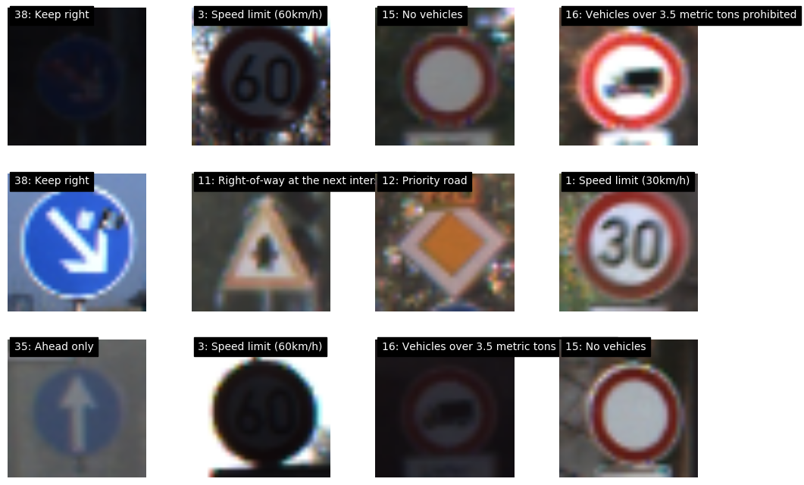
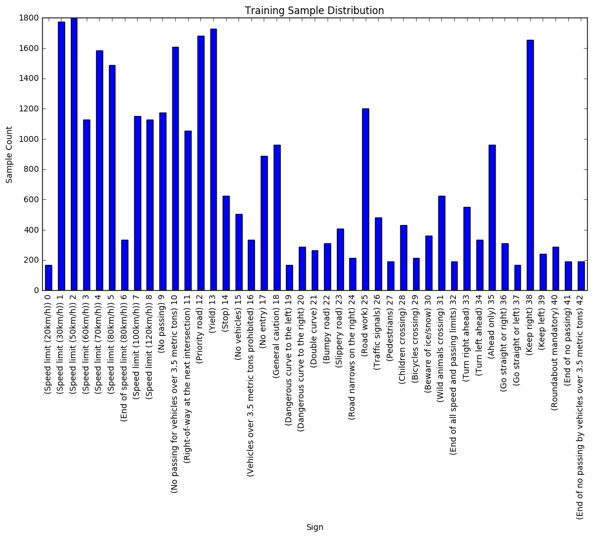
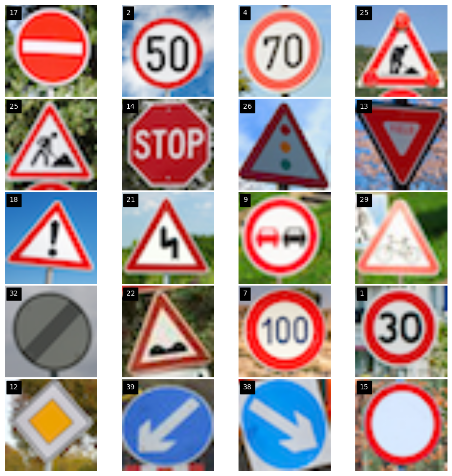
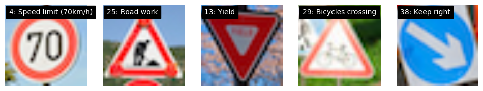
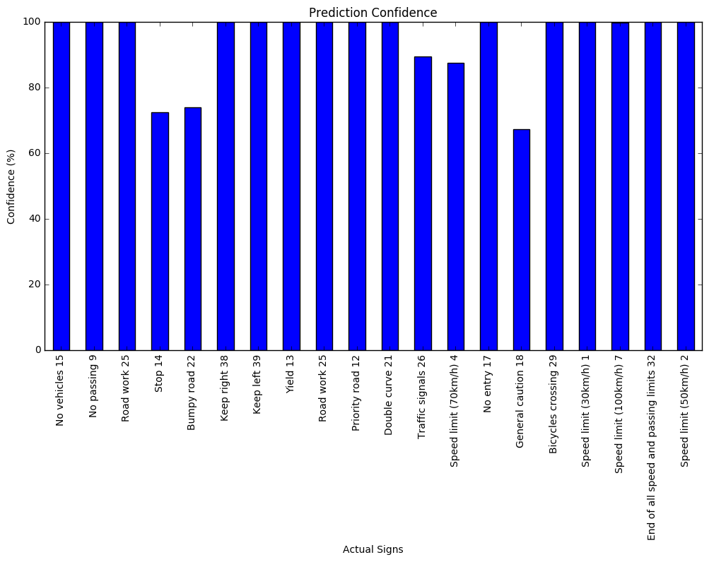

# LeNet for Traffic Sign Recognition

## Objective

This objective of this project is to train a classifier using Tensorflow and the German Traffic Signs Dataset.  The neural network architecture used here is a modified version of the LeNet model.

After training is completed, the trained classifier accuracy is evaluated using images of traffic signs that were not part of the training dataset.  This is all done within this Jupyter Notebook.


# Loading and Exploring the Data

The code below loads images from two different pickle datasets.  The first data set contains the training images that will be used for training.  The second data set contains the images for evaluation the performance of the classifier.


```python
import pickle
import tensorflow as tf


training_file = './traffic-signs-data/train.p'
testing_file = './traffic-signs-data/test.p'

with open(training_file, mode='rb') as f:
    train = pickle.load(f)
with open(testing_file, mode='rb') as f:
    test = pickle.load(f)
    
X_train, y_train = train['features'], train['labels']
X_test, y_test = test['features'], test['labels']

```

## Dataset Summary 

The pickled data is a dictionary with 4 key/value pairs:

- `'features'` is a 4D array containing raw pixel data of the traffic sign images, (num examples, width, height, channels).
- `'labels'` is a 2D array containing the label/class id of the traffic sign. The file `signnames.csv` contains id -> name mappings for each id.
- `'sizes'` is a list containing tuples, (width, height) representing the the original width and height the image.
- `'coords'` is a list containing tuples, (x1, y1, x2, y2) representing coordinates of a bounding box around the sign in the image. **THESE COORDINATES ASSUME THE ORIGINAL IMAGE. THE PICKLED DATA CONTAINS RESIZED VERSIONS (32 by 32) OF THESE IMAGES**

Contained below is the code used to output the details for the training and testing image datasets.


```python
# Number of training examples
n_train = len(y_train)

# Number of testing examples
n_test = len(y_test)

# shape of traffic sign image
image_shape = train['features'][1].shape

# unique classes/labels there in the dataset
n_classes = len(set(train['labels']))


print("Number of training examples =", n_train)
print("Number of testing examples =", n_test)
print("Image data shape =", image_shape)
print("Number of classes =", n_classes)
```

    Number of training examples = 39209
    Number of testing examples = 12630
    Image data shape = (32, 32, 3)
    Number of classes = 43


## Visualizing Dataset with Matplotlib

Next, we visualize the German Traffic Signs Dataset using the pickled file(s) using matplotlib.  This shows several smaples from the dataset of different signs with a label of what the sign type is.  Also shown is a graph representing the distribution of each sign type across the dataset.


```python
import matplotlib.pyplot as plt
import random
import pandas as pd
import csv 
import matplotlib.pyplot as plt
import matplotlib.pyplot as gridspec
from sklearn.utils import shuffle
import numpy as np
import operator
# Visualizations will be shown in the notebook using matplotlib.
%matplotlib inline

idx = 30000
x_train = train['features']
y_train = train['labels']

def lookupSignNames():
    signnames = {}
    with open('signnames.csv', 'r') as csvfile:
        reader = csv.reader(csvfile)
        for rows in reader:
            signnames[rows[0]] = rows[1]
    return signnames

def showSamplesPerSign(features, labels, signnames):
    samplesPerSign =  [0] * (len(signnames) - 1)
    
    for key, signname in signnames.items():
        if key != "ClassId":
            samplesPerSign[int(key)] = 0
        
    for idx, feature in enumerate(features):
        key = str(labels[idx])
        samplesPerSign[int(key)] += 1

    # show prediction confidence graph
    plt.figure(figsize=(12, 6))
    series = pd.Series.from_array(samplesPerSign)

    x_labels = range(0,len(samplesPerSign))
    ax = series.plot(kind='bar')
    ax.set_title("Training Sample Distribution")
    ax.set_xlabel("Sign")
    ax.set_ylabel("Sample Count")
    ax.set_xticklabels(["(" + (signnames[str(x)] + ") " + str(x)) for x in x_labels])

    plt.show()


def split_data(features, labels):
    X, y = shuffle(features, labels)
    training = {'features': [], 'labels': []}
    validate = {'features': [], 'labels': []}
    test = {'features': [], 'labels': []}
    
    label_counts = [0] * len(set(y))
    
    for idx, feature in enumerate(X):
        label = y[idx]
        label_counts[label] += 1
        
        if label_counts[label] <= 8:
            training['features'].append(feature)
            training['labels'].append(label)
        elif label_counts[label] == 9:
            validate['features'].append(feature)
            validate['labels'].append(label)
        else:
            test['features'].append(feature)
            test['labels'].append(label)
            label_counts[label] = 0
    
    training['features'] = np.array(training['features'])
    validate['features'] = np.array(validate['features'])
    test['features'] = np.array(test['features'])

    return training, validate, test 

def countOf(value, array):
    count = 0
    for element in array:
        if(element == value):
            count += 1
    return count

signnames = lookupSignNames()

# show some images at random
plt.figure(figsize=(12,8))
gs = gridspec.GridSpec(3, 4)

for x in range(0,12):
    index = random.randint(0, len(x_train))
    image = x_train[index].squeeze()

    ax = plt.subplot(gs[x])
    plt.axis('on')
    ax.set_aspect('equal')
    ax.set_xticklabels([])
    ax.set_yticklabels([])

    plt.text(1,2,str(y_train[index]) + ": " + signnames[str(y_train[index])], color='w',backgroundcolor='k')

    plt.imshow(image)
    plt.imshow(image)
    plt.axis('off')

plt.show()

training, validation, test = split_data(train['features'], train['labels'])

showSamplesPerSign(training['features'], training['labels'], signnames)
```

    /Users/chris/anaconda/envs/CarND-Traffic-Sign-Classifier-Project/lib/python3.5/site-packages/matplotlib/font_manager.py:273: UserWarning: Matplotlib is building the font cache using fc-list. This may take a moment.
      warnings.warn('Matplotlib is building the font cache using fc-list. This may take a moment.')
    /Users/chris/anaconda/envs/CarND-Traffic-Sign-Classifier-Project/lib/python3.5/site-packages/matplotlib/font_manager.py:273: UserWarning: Matplotlib is building the font cache using fc-list. This may take a moment.
      warnings.warn('Matplotlib is building the font cache using fc-list. This may take a moment.')








----

# Preprocessing Data

In order to prepare our data for training, preprocessing the dataset is necessary.  

The preprocessing used here is minimal.  Each image in the training set is converted to grayscale and then the rgb values are normalized.  Converting to grayscale allows us to reduce the dimensions of the training data from a 32x32x3 sample to a 32x32x1 sample.  In addition to reducing the dimensionality of each training sample, this also prevented the nueral network from relying on color data, which may vary significantly based off of lighting conditions.

One other approach I experimented with was using histogram equalization to try to increase the contrast of the images.  The idea was that this may help the neural network better distinguish features of the signs from the background.  In practice, this didn't seem to impact the prediction accuracy, so it wasn't used in the final implementation.


```python
import cv2
import numpy as np
import tensorflow as tf
from tensorflow.contrib.layers import flatten
from sklearn.utils import shuffle
import matplotlib.gridspec as gridspec
import time
import matplotlib.gridspec as gridspec

%matplotlib inline

def generate_data(features, labels):
    label_counts = {}
    
    for label in labels:
        label_counts[label] = { 'count': 0, 'start_idx': -1 }
    
    max_label_count = 0
    prev_label = -10
    
    for idx, feature in enumerate(features):
        label = labels[idx]
        if prev_label != label:
            label_counts[label]['start_idx'] = idx
            prev_label = label
        
        label_counts[label]['count'] += 1
        count = label_counts[label]['count']
            
        if max_label_count < count:
            max_label_count = count

    new_features = []
    new_labels = []
    
    for key in label_counts.keys():
        details = label_counts[key]
        count = details['count']
        start_idx = details['start_idx']
        diff = int(max_label_count * 1.25) - count
        
        for x in range(diff):
            src_image_idx = random.randint(start_idx, start_idx + count - 1)
            new_features.append(transform_image(features[src_image_idx],10,5,5))
            new_labels.append(key)

    return np.concatenate((features, new_features), axis=0), np.concatenate((labels, new_labels), axis=0)
            
def transform_image(img,ang_range,shear_range,trans_range):
    ''' 
    This method is not my own work, it was obtained from:
    https://medium.com/@vivek.yadav/dealing-with-unbalanced-data-generating-additional-data-by-jittering-the-original-image-7497fe2119c3#.hl94b7jvr
    
    This function transforms images to generate new images.
    The function takes in following arguments,
    1- Image
    2- ang_range: Range of angles for rotation
    3- shear_range: Range of values to apply affine transform to
    4- trans_range: Range of values to apply translations over. 
    
    A Random uniform distribution is used to generate different parameters for transformation
    
    '''
    # Rotation
    ang_rot = np.random.uniform(ang_range)-ang_range/2
    rows,cols,ch = img.shape    
    Rot_M = cv2.getRotationMatrix2D((cols/2,rows/2),ang_rot,1)

    # Translation
    tr_x = trans_range*np.random.uniform()-trans_range/2
    tr_y = trans_range*np.random.uniform()-trans_range/2
    Trans_M = np.float32([[1,0,tr_x],[0,1,tr_y]])

    # Shear
    pts1 = np.float32([[5,5],[20,5],[5,20]])

    pt1 = 5+shear_range*np.random.uniform()-shear_range/2
    pt2 = 20+shear_range*np.random.uniform()-shear_range/2

    pts2 = np.float32([[pt1,5],[pt2,pt1],[5,pt2]])

    shear_M = cv2.getAffineTransform(pts1,pts2)
        
    img = cv2.warpAffine(img,Rot_M,(cols,rows))
    img = cv2.warpAffine(img,Trans_M,(cols,rows))
    img = cv2.warpAffine(img,shear_M,(cols,rows))
    
    return img

def preprocess_data(features, labels):
    x_train, y_train = shuffle(features, labels)
    
    processed_features = np.empty([len(x_train), 32, 32, 1])
    
    for idx, feature in enumerate(x_train):
        # convert to grayscale
        preprocessed_feature = cv2.cvtColor(feature, cv2.COLOR_RGB2GRAY)

        # equalize
        preprocessed_feature = cv2.equalizeHist(preprocessed_feature)
        
        # normalize, convert pixel values from range of 0 to 255 to -1 to 1
        preprocessed_feature = [ (x - 127.5) / 255.0 for x in preprocessed_feature]
        
        
        preprocessed_feature = np.expand_dims(preprocessed_feature, axis=2)
        processed_features[idx] = preprocessed_feature

    return processed_features, y_train

```

# Splitting Up Images And Image Generation

The sign images where split up into training, validation, and test sets.  The training set contained 80% of the available images, the validation set contained approximately 10% of the images, the testing set contained roughly 10% of the available images.  This distribution allowed for a large training set to be used at the cost of accurate validation and a more limited test set for evaluating the performance of the network.

I also experimented with generating data.  Since there was not a proportionate representation of images for each sign, I thought generating data to produce an equal number of images for each sign type would improve results, as it would be less biased towards signs with a larger number of samples in the training set.

The approach I used was to use samples from the existing data set and apply shearing and random rotations (identical to the approach described here  https://medium.com/@vivek.yadav/dealing-with-unbalanced-data-generating-additional-data-by-jittering-the-original-image-7497fe2119c3#.hl94b7jvr).  I hoped this would improve the performance of the model on images that were taken from various angles.  

The first solution I implemented found the sign with the most images in the sample set.  It then generated images for all other signs until the total number of images for each sign was equal.  After evaluating this approach, I realized that all signs need some generated data.  Next, I generated images so that each sign's sample count would be twice the number of the sign with largest amount of data.  This means that the sign with the most original images would have 50% of its data generated and every other sign would have more than 50% of its data generated.

With the size of the training set now significantly larger, it took much longer to train.  After a few epochs, I noticed that my accuracy was consistently coming to 2.3%, which is no better than randomly guessing a classification for a sign.  For this reason, I abandonned generating any additional samples for the training set in the final implementation.


```python
def split_data(features, labels):
    X, y = shuffle(features, labels)
    training = {'features': [], 'labels': []}
    validate = {'features': [], 'labels': []}
    test = {'features': [], 'labels': []}
    
    label_counts = [0] * len(set(y))
    
    for idx, feature in enumerate(X):
        label = y[idx]
        label_counts[label] += 1
        
        # 80% of samples are used for training set
        if label_counts[label] <= 8:  
            training['features'].append(feature)
            training['labels'].append(label)
        # 10% of samples used for validation set
        elif label_counts[label] <= 9:
            validate['features'].append(feature)
            validate['labels'].append(label)
        # 10% if samples are used for test set
        else:
            test['features'].append(feature)
            test['labels'].append(label)
            if(label_counts[label] == 10):
                label_counts[label] = 0
    
    training['features'] = np.array(training['features'])
    validate['features'] = np.array(validate['features'])
    test['features'] = np.array(test['features'])

    return training, validate, test 
```

# Step 3: Defining the Neural Network Architecture

The final architecture was almost identical the the infamous LeNet implementation. Dropout was introduced between the fully connected layers to help prevent the model from overfitting to the training set.  The final architecture is as follows: 

- The first layer was a convolutional layer which took in the grayscale images from the training set (with dimensions of 32x32x1) and outputs a 28x28x6 sample
- ReLU activation is applied
- Max pooling is performed, transforming the 28x28x6 sample to a 14x14x6 sample
- The second layer is another convolutional layer, taking in a 14x14x6 sample and producing a 10x10x16 sample
- ReLU activation is applied again
- Max pooling is performed, resulting in a 5x5x16 sample
- The 5x5x16 sample is flattened to 400 samples 
- The 400 samples are fed into a fully connected layer resulting in 120 outputs
- ReLU activation is appled to the result
- Dropout is applied to help prevent overfitting
- The 120 samples are fed into another fully connected layer, resulting in 84 outputs
- ReLU activation is appled to the result
- Dropout is applied to help prevent overfitting
- The 84 samples are fed into the final fully connected layer, resulting in 42 outputs (one for each sign)


```python
def LeNet(x): 
    class_count = 43
    mu = 0
    sigma = 0.001

    """
    LeNet implementation
      x: feature layer
      class_count: number of classifications in y
      mu: mean for initializing weights
      sigma: standard deviation for intializing weights
    """
    # L1 - Convolutional: 32x32x1 => 28x28x6
    conv1_W = tf.Variable(tf.truncated_normal(shape=(5, 5, 1, 6), mean = mu, stddev = sigma), name="conv1W")
    conv1_b = tf.Variable(tf.zeros(6), name="conv1b")
    conv1 = tf.nn.conv2d(x, conv1_W, strides=[1, 1, 1, 1], padding='VALID') + conv1_b

    # Activation
    conv1 = tf.nn.relu(conv1)

    # Max pooling: 28x28x6 => 14x14x6
    conv1 = tf.nn.max_pool(conv1, ksize=[1, 2, 2, 1], strides=[1, 2, 2, 1], padding='VALID')

    # L2 - Convolutional: 14x14x6 => 10x10x16.
    conv2_W = tf.Variable(tf.truncated_normal(shape=(5, 5, 6, 16), mean = mu, stddev = sigma), name="conv2W")
    conv2_b = tf.Variable(tf.zeros(16), name="conv2b")
    conv2 = tf.nn.conv2d(conv1, conv2_W, strides=[1, 1, 1, 1], padding='VALID') + conv2_b

    # Activation
    conv2 = tf.nn.relu(conv2)

    # Max Pooling: 10x10x16 => 5x5x16
    conv2 = tf.nn.max_pool(conv2, ksize=[1, 2, 2, 1], strides=[1, 2, 2, 1], padding='VALID')

    # Flatten: 5x5x16 => 400.
    fc0 = flatten(conv2)

    # L3 - Fully Connected: 400 => 120
    fc1_W = tf.Variable(tf.truncated_normal(shape=(400, 120), mean = mu, stddev = sigma), name="fc1W")
    fc1_b = tf.Variable(tf.zeros(120), name="fc1b")
    fc1 = tf.add(tf.matmul(fc0, fc1_W), fc1_b)

    # Activation
    fc1 = tf.nn.relu(fc1)
    
    # Dropout
    fc1 = tf.nn.dropout(fc1, dropout_keep_prob)

    # L4 - Fully Connected: 120 => 84
    fc2_W  = tf.Variable(tf.truncated_normal(shape=(120, 84), mean = mu, stddev = sigma), name="fc2W")
    fc2_b  = tf.Variable(tf.zeros(84), name="fc2b")
    fc2 = tf.add(tf.matmul(fc1, fc2_W), fc2_b)

    # Activation.
    fc2 = tf.nn.relu(fc2)
    
    # Dropout
    fc2 = tf.nn.dropout(fc2, dropout_keep_prob)

    # L5 - Fully Connected:  84 => class_count
    fc3_W  = tf.Variable(tf.truncated_normal(shape=(84, class_count), mean = mu, stddev = sigma), name="fc3W")
    fc3_b  = tf.Variable(tf.zeros(class_count), name="fc3b")  
    logits = tf.add(tf.matmul(fc2, fc3_W), fc3_b, name="logits")

    return logits

```

# Step 4: Training 

The LeNet-5 architecture was chosen initially for the following reasons:

- Relatively easy to understand and implement
- Proven track record of good performance for image recongition
- Well studied and documented
- Not Hardware Restrictive - 100's of epochs can be run on given data set in a couple hours on high end personal PC


My approach was to implement the LeNET-5 architecture, adjust hyper parameters to optimize performance, and then come back and evaluate whether a more custom solution was needed.  

After spending a good amount of time adjusting the hyper parameters and introducing dropout to the model to reduce overfitting, I believed that the performance of the LeNet architecture was likely better than another convolutional architecture I would have been able to create within the hardware constraints and time constraints for this project.

A lot of trial and error went into determining values for the hyperparameters used in this model.  Out of the values I experimented with, the optimal hyperparametrs I found are as follows:

- Epohcs: 400  Realistically this could probably be much lower.  After running and looking over the validation accuracy after each epoch, it seems no real gain using this many epochs.  I wasn't too concerned about overfitting since I was using a fairly agressive dropout rate on the fully connected layers.
- Batch Size: 64
- Optimizer: AdamOptimizer
- Learning Rate: 0.001  This proved to be a low enough value to get accurate results without getting stuck in a local minima.
- Dropout Rate: 0.6  Keeping 60% of the values from the fully connected layers seemed to be sufficient for preventing overfitting and still acheiving accurate predictions

I suspect the performance of my LeNET implementation could be even further increased by further exploring other preprocessing approaches on the training set and generating more training samples for the existing image set.

In the future, I plan to experiment with this architecture a bit more, possibly adding additional convolutional layers and trying to capture more lower level features.


```python

def evaluate_data(X_data, y_data, batch_size):
    """
    Given a dataset as input returns the accuracy.
    """
    sample_count = len(X_data)
    total_accuracy = 0
    sess = tf.get_default_session()
    for offset in range(0, sample_count, batch_size):
        batch_x, batch_y = X_data[offset:offset+batch_size], y_data[offset:offset+batch_size]
        accuracy = sess.run(accuracy_op, feed_dict={x: batch_x, y: batch_y, dropout_keep_prob: 1.0})
        total_accuracy += (accuracy * len(batch_x))
        
    return total_accuracy / sample_count

"""
Main
"""
# using generated data
# x_data, y_data = generate_data(train['features'], train['labels'])
# x_data, y_data = preprocess_data(x_data, y_data)

# using default data
x_data, y_data = preprocess_data(train['features'], train['labels'])

training, validation, test = split_data(x_data, y_data)

x_train, y_train = training['features'], training['labels']
x_validation, y_validation = validation['features'], validation['labels']
x_test, y_test = test['features'], test['labels']


FEATURE_COUNT = len(x_train)
CLASS_COUNT  = len(set(y_train))

EPOCHS = 400
BATCH_SIZE = 64
MEAN = 0
SIGMA = 0.001
LEARNING_RATE = 0.001
DROPOUT_KEEP_PROB = 0.6

x = tf.placeholder(tf.float32, (None, 32,32,1), name="x")
y = tf.placeholder(tf.int32, (None), name="y")
one_hot_y = tf.one_hot(y, CLASS_COUNT)

dropout_keep_prob = tf.placeholder(tf.float32)

# training pipeline
logits = LeNet(x)

loss_op = tf.reduce_mean(tf.nn.softmax_cross_entropy_with_logits(logits, one_hot_y))
opt = tf.train.AdamOptimizer(LEARNING_RATE)
train_op = opt.minimize(loss_op)

# evaluation 
correct_prediction = tf.equal(tf.argmax(logits, 1), tf.argmax(one_hot_y, 1))
accuracy_op = tf.reduce_mean(tf.cast(correct_prediction, tf.float32))

with tf.Session() as sess:
    sess.run(tf.global_variables_initializer())
    steps_per_epoch = FEATURE_COUNT // BATCH_SIZE
    num_examples = FEATURE_COUNT
    
    total_start_time = time.time()
    max_accuracy = 0
    
    # Train model
    for i in range(EPOCHS):
        print("Processing epoch: ", i + 1, "/", EPOCHS)
        start_time = time.time()
        x_train, y_train = shuffle(x_train, y_train)
        for offset in range(0, num_examples, BATCH_SIZE):
            end = offset + BATCH_SIZE
            batch_x, batch_y = x_train[offset:end], y_train[offset:end]
            sess.run(train_op, feed_dict={x: batch_x, y: batch_y, dropout_keep_prob: DROPOUT_KEEP_PROB})
            
        print("Finished training epoch #", i + 1, "in: {:.3f}".format(time.time() - start_time), "seconds.")
        
        # evaluate against validation data
        validation_accuracy = evaluate_data(x_validation, y_validation, BATCH_SIZE)
        print("Validation accuracy = {:.3f}".format(validation_accuracy))
    
    print("TOTAL TIME: {:.3f}".format(time.time() - total_start_time))

    # Evaluate on the test data
    test_accuracy = evaluate_data(x_test, y_test, BATCH_SIZE)
    print("Test accuracy = {:.3f}".format(test_accuracy))

    # Save trained model
    try:
        saver
    except NameError:
        saver = tf.train.Saver()
    saver.save(sess, 'lenet')
    print("Model saved")
```

    Processing epoch:  1 / 400
    Finished training epoch # 1 in: 15.308 seconds.
    Validation accuracy = 0.103
    Processing epoch:  2 / 400
    Finished training epoch # 2 in: 15.256 seconds.
    Validation accuracy = 0.269
    Processing epoch:  3 / 400
    Finished training epoch # 3 in: 15.138 seconds.
    Validation accuracy = 0.503
    Processing epoch:  4 / 400
    Finished training epoch # 4 in: 15.039 seconds.
    Validation accuracy = 0.669
    Processing epoch:  5 / 400
    Finished training epoch # 5 in: 15.000 seconds.
    Validation accuracy = 0.762
    Processing epoch:  6 / 400
    Finished training epoch # 6 in: 15.105 seconds.
    Validation accuracy = 0.777
    Processing epoch:  7 / 400
    Finished training epoch # 7 in: 13.338 seconds.
    Validation accuracy = 0.831
    Processing epoch:  8 / 400
    Finished training epoch # 8 in: 12.791 seconds.
    Validation accuracy = 0.855
    Processing epoch:  9 / 400
    Finished training epoch # 9 in: 12.762 seconds.
    Validation accuracy = 0.871
    Processing epoch:  10 / 400
    Finished training epoch # 10 in: 12.473 seconds.
    Validation accuracy = 0.885
    Processing epoch:  11 / 400
    Finished training epoch # 11 in: 12.600 seconds.
    Validation accuracy = 0.894
    Processing epoch:  12 / 400
    Finished training epoch # 12 in: 12.577 seconds.
    Validation accuracy = 0.906
    Processing epoch:  13 / 400
    Finished training epoch # 13 in: 12.675 seconds.
    Validation accuracy = 0.906
    Processing epoch:  14 / 400
    Finished training epoch # 14 in: 12.698 seconds.
    Validation accuracy = 0.916
    Processing epoch:  15 / 400
    Finished training epoch # 15 in: 13.575 seconds.
    Validation accuracy = 0.917
    Processing epoch:  16 / 400
    Finished training epoch # 16 in: 12.771 seconds.
    Validation accuracy = 0.921
    Processing epoch:  17 / 400
    Finished training epoch # 17 in: 12.696 seconds.
    Validation accuracy = 0.923
    Processing epoch:  18 / 400
    Finished training epoch # 18 in: 13.002 seconds.
    Validation accuracy = 0.930
    Processing epoch:  19 / 400
    Finished training epoch # 19 in: 13.076 seconds.
    Validation accuracy = 0.940
    Processing epoch:  20 / 400
    Finished training epoch # 20 in: 13.219 seconds.
    Validation accuracy = 0.943
    Processing epoch:  21 / 400
    Finished training epoch # 21 in: 12.787 seconds.
    Validation accuracy = 0.945
    Processing epoch:  22 / 400
    Finished training epoch # 22 in: 12.659 seconds.
    Validation accuracy = 0.947
    Processing epoch:  23 / 400
    Finished training epoch # 23 in: 12.671 seconds.
    Validation accuracy = 0.955
    Processing epoch:  24 / 400
    Finished training epoch # 24 in: 12.638 seconds.
    Validation accuracy = 0.955
    Processing epoch:  25 / 400
    Finished training epoch # 25 in: 12.508 seconds.
    Validation accuracy = 0.953
    Processing epoch:  26 / 400
    Finished training epoch # 26 in: 12.787 seconds.
    Validation accuracy = 0.958
    Processing epoch:  27 / 400
    Finished training epoch # 27 in: 13.009 seconds.
    Validation accuracy = 0.957
    Processing epoch:  28 / 400
    Finished training epoch # 28 in: 12.540 seconds.
    Validation accuracy = 0.960
    Processing epoch:  29 / 400
    Finished training epoch # 29 in: 12.524 seconds.
    Validation accuracy = 0.956
    Processing epoch:  30 / 400
    Finished training epoch # 30 in: 12.725 seconds.
    Validation accuracy = 0.959
    Processing epoch:  31 / 400
    Finished training epoch # 31 in: 12.721 seconds.
    Validation accuracy = 0.962
    Processing epoch:  32 / 400
    Finished training epoch # 32 in: 12.648 seconds.
    Validation accuracy = 0.961
    Processing epoch:  33 / 400
    Finished training epoch # 33 in: 12.686 seconds.
    Validation accuracy = 0.961
    Processing epoch:  34 / 400
    Finished training epoch # 34 in: 12.577 seconds.
    Validation accuracy = 0.959
    Processing epoch:  35 / 400
    Finished training epoch # 35 in: 12.749 seconds.
    Validation accuracy = 0.962
    Processing epoch:  36 / 400
    Finished training epoch # 36 in: 12.797 seconds.
    Validation accuracy = 0.961
    Processing epoch:  37 / 400
    Finished training epoch # 37 in: 12.592 seconds.
    Validation accuracy = 0.967
    Processing epoch:  38 / 400
    Finished training epoch # 38 in: 12.703 seconds.
    Validation accuracy = 0.966
    Processing epoch:  39 / 400
    Finished training epoch # 39 in: 12.488 seconds.
    Validation accuracy = 0.967
    Processing epoch:  40 / 400
    Finished training epoch # 40 in: 12.540 seconds.
    Validation accuracy = 0.959
    Processing epoch:  41 / 400
    Finished training epoch # 41 in: 12.933 seconds.
    Validation accuracy = 0.964
    Processing epoch:  42 / 400
    Finished training epoch # 42 in: 13.018 seconds.
    Validation accuracy = 0.965
    Processing epoch:  43 / 400
    Finished training epoch # 43 in: 12.542 seconds.
    Validation accuracy = 0.968
    Processing epoch:  44 / 400
    Finished training epoch # 44 in: 12.776 seconds.
    Validation accuracy = 0.965
    Processing epoch:  45 / 400
    Finished training epoch # 45 in: 12.825 seconds.
    Validation accuracy = 0.969
    Processing epoch:  46 / 400
    Finished training epoch # 46 in: 12.827 seconds.
    Validation accuracy = 0.965
    Processing epoch:  47 / 400
    Finished training epoch # 47 in: 13.296 seconds.
    Validation accuracy = 0.969
    Processing epoch:  48 / 400
    Finished training epoch # 48 in: 13.641 seconds.
    Validation accuracy = 0.966
    Processing epoch:  49 / 400
    Finished training epoch # 49 in: 12.867 seconds.
    Validation accuracy = 0.970
    Processing epoch:  50 / 400
    Finished training epoch # 50 in: 12.773 seconds.
    Validation accuracy = 0.967
    Processing epoch:  51 / 400
    Finished training epoch # 51 in: 12.754 seconds.
    Validation accuracy = 0.970
    Processing epoch:  52 / 400
    Finished training epoch # 52 in: 12.707 seconds.
    Validation accuracy = 0.968
    Processing epoch:  53 / 400
    Finished training epoch # 53 in: 12.828 seconds.
    Validation accuracy = 0.971
    Processing epoch:  54 / 400
    Finished training epoch # 54 in: 12.645 seconds.
    Validation accuracy = 0.969
    Processing epoch:  55 / 400
    Finished training epoch # 55 in: 12.583 seconds.
    Validation accuracy = 0.971
    Processing epoch:  56 / 400
    Finished training epoch # 56 in: 12.707 seconds.
    Validation accuracy = 0.969
    Processing epoch:  57 / 400
    Finished training epoch # 57 in: 12.638 seconds.
    Validation accuracy = 0.969
    Processing epoch:  58 / 400
    Finished training epoch # 58 in: 14.148 seconds.
    Validation accuracy = 0.970
    Processing epoch:  59 / 400
    Finished training epoch # 59 in: 12.595 seconds.
    Validation accuracy = 0.975
    Processing epoch:  60 / 400
    Finished training epoch # 60 in: 12.679 seconds.
    Validation accuracy = 0.974
    Processing epoch:  61 / 400
    Finished training epoch # 61 in: 12.650 seconds.
    Validation accuracy = 0.970
    Processing epoch:  62 / 400
    Finished training epoch # 62 in: 12.583 seconds.
    Validation accuracy = 0.971
    Processing epoch:  63 / 400
    Finished training epoch # 63 in: 12.618 seconds.
    Validation accuracy = 0.973
    Processing epoch:  64 / 400
    Finished training epoch # 64 in: 12.536 seconds.
    Validation accuracy = 0.969
    Processing epoch:  65 / 400
    Finished training epoch # 65 in: 12.449 seconds.
    Validation accuracy = 0.973
    Processing epoch:  66 / 400
    Finished training epoch # 66 in: 12.483 seconds.
    Validation accuracy = 0.975
    Processing epoch:  67 / 400
    Finished training epoch # 67 in: 12.409 seconds.
    Validation accuracy = 0.972
    Processing epoch:  68 / 400
    Finished training epoch # 68 in: 12.661 seconds.
    Validation accuracy = 0.975
    Processing epoch:  69 / 400
    Finished training epoch # 69 in: 12.395 seconds.
    Validation accuracy = 0.976
    Processing epoch:  70 / 400
    Finished training epoch # 70 in: 12.418 seconds.
    Validation accuracy = 0.973
    Processing epoch:  71 / 400
    Finished training epoch # 71 in: 12.677 seconds.
    Validation accuracy = 0.975
    Processing epoch:  72 / 400
    Finished training epoch # 72 in: 12.496 seconds.
    Validation accuracy = 0.975
    Processing epoch:  73 / 400
    Finished training epoch # 73 in: 12.398 seconds.
    Validation accuracy = 0.978
    Processing epoch:  74 / 400
    Finished training epoch # 74 in: 12.476 seconds.
    Validation accuracy = 0.977
    Processing epoch:  75 / 400
    Finished training epoch # 75 in: 12.480 seconds.
    Validation accuracy = 0.976
    Processing epoch:  76 / 400
    Finished training epoch # 76 in: 12.398 seconds.
    Validation accuracy = 0.976
    Processing epoch:  77 / 400
    Finished training epoch # 77 in: 12.384 seconds.
    Validation accuracy = 0.970
    Processing epoch:  78 / 400
    Finished training epoch # 78 in: 12.409 seconds.
    Validation accuracy = 0.976
    Processing epoch:  79 / 400
    Finished training epoch # 79 in: 12.363 seconds.
    Validation accuracy = 0.973
    Processing epoch:  80 / 400
    Finished training epoch # 80 in: 12.399 seconds.
    Validation accuracy = 0.971
    Processing epoch:  81 / 400
    Finished training epoch # 81 in: 12.478 seconds.
    Validation accuracy = 0.976
    Processing epoch:  82 / 400
    Finished training epoch # 82 in: 13.617 seconds.
    Validation accuracy = 0.975
    Processing epoch:  83 / 400
    Finished training epoch # 83 in: 16.312 seconds.
    Validation accuracy = 0.970
    Processing epoch:  84 / 400
    Finished training epoch # 84 in: 13.987 seconds.
    Validation accuracy = 0.977
    Processing epoch:  85 / 400
    Finished training epoch # 85 in: 14.027 seconds.
    Validation accuracy = 0.974
    Processing epoch:  86 / 400
    Finished training epoch # 86 in: 14.215 seconds.
    Validation accuracy = 0.974
    Processing epoch:  87 / 400
    Finished training epoch # 87 in: 14.133 seconds.
    Validation accuracy = 0.974
    Processing epoch:  88 / 400
    Finished training epoch # 88 in: 14.021 seconds.
    Validation accuracy = 0.976
    Processing epoch:  89 / 400
    Finished training epoch # 89 in: 14.022 seconds.
    Validation accuracy = 0.974
    Processing epoch:  90 / 400
    Finished training epoch # 90 in: 14.085 seconds.
    Validation accuracy = 0.977
    Processing epoch:  91 / 400
    Finished training epoch # 91 in: 14.084 seconds.
    Validation accuracy = 0.977
    Processing epoch:  92 / 400
    Finished training epoch # 92 in: 13.907 seconds.
    Validation accuracy = 0.975
    Processing epoch:  93 / 400
    Finished training epoch # 93 in: 14.188 seconds.
    Validation accuracy = 0.976
    Processing epoch:  94 / 400
    Finished training epoch # 94 in: 13.992 seconds.
    Validation accuracy = 0.977
    Processing epoch:  95 / 400
    Finished training epoch # 95 in: 14.093 seconds.
    Validation accuracy = 0.972
    Processing epoch:  96 / 400
    Finished training epoch # 96 in: 14.139 seconds.
    Validation accuracy = 0.974
    Processing epoch:  97 / 400
    Finished training epoch # 97 in: 14.357 seconds.
    Validation accuracy = 0.974
    Processing epoch:  98 / 400
    Finished training epoch # 98 in: 14.215 seconds.
    Validation accuracy = 0.977
    Processing epoch:  99 / 400
    Finished training epoch # 99 in: 14.143 seconds.
    Validation accuracy = 0.978
    Processing epoch:  100 / 400
    Finished training epoch # 100 in: 14.283 seconds.
    Validation accuracy = 0.976
    Processing epoch:  101 / 400
    Finished training epoch # 101 in: 14.485 seconds.
    Validation accuracy = 0.976
    Processing epoch:  102 / 400
    Finished training epoch # 102 in: 13.577 seconds.
    Validation accuracy = 0.976
    Processing epoch:  103 / 400
    Finished training epoch # 103 in: 13.265 seconds.
    Validation accuracy = 0.974
    Processing epoch:  104 / 400
    Finished training epoch # 104 in: 12.974 seconds.
    Validation accuracy = 0.976
    Processing epoch:  105 / 400
    Finished training epoch # 105 in: 12.890 seconds.
    Validation accuracy = 0.974
    Processing epoch:  106 / 400
    Finished training epoch # 106 in: 12.928 seconds.
    Validation accuracy = 0.976
    Processing epoch:  107 / 400
    Finished training epoch # 107 in: 12.826 seconds.
    Validation accuracy = 0.976
    Processing epoch:  108 / 400
    Finished training epoch # 108 in: 12.755 seconds.
    Validation accuracy = 0.977
    Processing epoch:  109 / 400
    Finished training epoch # 109 in: 12.888 seconds.
    Validation accuracy = 0.975
    Processing epoch:  110 / 400
    Finished training epoch # 110 in: 12.871 seconds.
    Validation accuracy = 0.980
    Processing epoch:  111 / 400
    Finished training epoch # 111 in: 13.256 seconds.
    Validation accuracy = 0.976
    Processing epoch:  112 / 400
    Finished training epoch # 112 in: 13.210 seconds.
    Validation accuracy = 0.974
    Processing epoch:  113 / 400
    Finished training epoch # 113 in: 12.716 seconds.
    Validation accuracy = 0.978
    Processing epoch:  114 / 400
    Finished training epoch # 114 in: 12.860 seconds.
    Validation accuracy = 0.978
    Processing epoch:  115 / 400
    Finished training epoch # 115 in: 12.576 seconds.
    Validation accuracy = 0.978
    Processing epoch:  116 / 400
    Finished training epoch # 116 in: 12.561 seconds.
    Validation accuracy = 0.973
    Processing epoch:  117 / 400
    Finished training epoch # 117 in: 12.540 seconds.
    Validation accuracy = 0.973
    Processing epoch:  118 / 400
    Finished training epoch # 118 in: 12.572 seconds.
    Validation accuracy = 0.977
    Processing epoch:  119 / 400
    Finished training epoch # 119 in: 12.624 seconds.
    Validation accuracy = 0.978
    Processing epoch:  120 / 400
    Finished training epoch # 120 in: 12.629 seconds.
    Validation accuracy = 0.974
    Processing epoch:  121 / 400
    Finished training epoch # 121 in: 12.535 seconds.
    Validation accuracy = 0.972
    Processing epoch:  122 / 400
    Finished training epoch # 122 in: 12.499 seconds.
    Validation accuracy = 0.975
    Processing epoch:  123 / 400
    Finished training epoch # 123 in: 12.739 seconds.
    Validation accuracy = 0.977
    Processing epoch:  124 / 400
    Finished training epoch # 124 in: 12.547 seconds.
    Validation accuracy = 0.977
    Processing epoch:  125 / 400
    Finished training epoch # 125 in: 12.591 seconds.
    Validation accuracy = 0.979
    Processing epoch:  126 / 400
    Finished training epoch # 126 in: 12.586 seconds.
    Validation accuracy = 0.978
    Processing epoch:  127 / 400
    Finished training epoch # 127 in: 12.615 seconds.
    Validation accuracy = 0.978
    Processing epoch:  128 / 400
    Finished training epoch # 128 in: 12.486 seconds.
    Validation accuracy = 0.977
    Processing epoch:  129 / 400
    Finished training epoch # 129 in: 12.574 seconds.
    Validation accuracy = 0.976
    Processing epoch:  130 / 400
    Finished training epoch # 130 in: 12.751 seconds.
    Validation accuracy = 0.976
    Processing epoch:  131 / 400
    Finished training epoch # 131 in: 12.740 seconds.
    Validation accuracy = 0.977
    Processing epoch:  132 / 400
    Finished training epoch # 132 in: 12.713 seconds.
    Validation accuracy = 0.974
    Processing epoch:  133 / 400
    Finished training epoch # 133 in: 12.588 seconds.
    Validation accuracy = 0.976
    Processing epoch:  134 / 400
    Finished training epoch # 134 in: 12.529 seconds.
    Validation accuracy = 0.974
    Processing epoch:  135 / 400
    Finished training epoch # 135 in: 13.680 seconds.
    Validation accuracy = 0.973
    Processing epoch:  136 / 400
    Finished training epoch # 136 in: 14.260 seconds.
    Validation accuracy = 0.975
    Processing epoch:  137 / 400
    Finished training epoch # 137 in: 14.261 seconds.
    Validation accuracy = 0.974
    Processing epoch:  138 / 400
    Finished training epoch # 138 in: 13.994 seconds.
    Validation accuracy = 0.976
    Processing epoch:  139 / 400
    Finished training epoch # 139 in: 14.125 seconds.
    Validation accuracy = 0.975
    Processing epoch:  140 / 400
    Finished training epoch # 140 in: 14.201 seconds.
    Validation accuracy = 0.973
    Processing epoch:  141 / 400
    Finished training epoch # 141 in: 14.265 seconds.
    Validation accuracy = 0.978
    Processing epoch:  142 / 400
    Finished training epoch # 142 in: 14.221 seconds.
    Validation accuracy = 0.977
    Processing epoch:  143 / 400
    Finished training epoch # 143 in: 14.191 seconds.
    Validation accuracy = 0.976
    Processing epoch:  144 / 400
    Finished training epoch # 144 in: 14.202 seconds.
    Validation accuracy = 0.978
    Processing epoch:  145 / 400
    Finished training epoch # 145 in: 14.148 seconds.
    Validation accuracy = 0.980
    Processing epoch:  146 / 400
    Finished training epoch # 146 in: 14.479 seconds.
    Validation accuracy = 0.977
    Processing epoch:  147 / 400
    Finished training epoch # 147 in: 14.271 seconds.
    Validation accuracy = 0.978
    Processing epoch:  148 / 400
    Finished training epoch # 148 in: 14.183 seconds.
    Validation accuracy = 0.976
    Processing epoch:  149 / 400
    Finished training epoch # 149 in: 14.383 seconds.
    Validation accuracy = 0.975
    Processing epoch:  150 / 400
    Finished training epoch # 150 in: 14.460 seconds.
    Validation accuracy = 0.979
    Processing epoch:  151 / 400
    Finished training epoch # 151 in: 13.996 seconds.
    Validation accuracy = 0.974
    Processing epoch:  152 / 400
    Finished training epoch # 152 in: 13.167 seconds.
    Validation accuracy = 0.977
    Processing epoch:  153 / 400
    Finished training epoch # 153 in: 13.158 seconds.
    Validation accuracy = 0.975
    Processing epoch:  154 / 400
    Finished training epoch # 154 in: 13.321 seconds.
    Validation accuracy = 0.976
    Processing epoch:  155 / 400
    Finished training epoch # 155 in: 13.010 seconds.
    Validation accuracy = 0.976
    Processing epoch:  156 / 400
    Finished training epoch # 156 in: 13.247 seconds.
    Validation accuracy = 0.978
    Processing epoch:  157 / 400
    Finished training epoch # 157 in: 14.184 seconds.
    Validation accuracy = 0.977
    Processing epoch:  158 / 400
    Finished training epoch # 158 in: 13.130 seconds.
    Validation accuracy = 0.975
    Processing epoch:  159 / 400
    Finished training epoch # 159 in: 12.763 seconds.
    Validation accuracy = 0.979
    Processing epoch:  160 / 400
    Finished training epoch # 160 in: 12.888 seconds.
    Validation accuracy = 0.978
    Processing epoch:  161 / 400
    Finished training epoch # 161 in: 13.438 seconds.
    Validation accuracy = 0.982
    Processing epoch:  162 / 400
    Finished training epoch # 162 in: 13.214 seconds.
    Validation accuracy = 0.979
    Processing epoch:  163 / 400
    Finished training epoch # 163 in: 13.235 seconds.
    Validation accuracy = 0.978
    Processing epoch:  164 / 400
    Finished training epoch # 164 in: 12.799 seconds.
    Validation accuracy = 0.973
    Processing epoch:  165 / 400
    Finished training epoch # 165 in: 12.743 seconds.
    Validation accuracy = 0.977
    Processing epoch:  166 / 400
    Finished training epoch # 166 in: 13.069 seconds.
    Validation accuracy = 0.975
    Processing epoch:  167 / 400
    Finished training epoch # 167 in: 12.962 seconds.
    Validation accuracy = 0.975
    Processing epoch:  168 / 400
    Finished training epoch # 168 in: 13.117 seconds.
    Validation accuracy = 0.978
    Processing epoch:  169 / 400
    Finished training epoch # 169 in: 12.843 seconds.
    Validation accuracy = 0.978
    Processing epoch:  170 / 400
    Finished training epoch # 170 in: 12.718 seconds.
    Validation accuracy = 0.975
    Processing epoch:  171 / 400
    Finished training epoch # 171 in: 12.753 seconds.
    Validation accuracy = 0.977
    Processing epoch:  172 / 400
    Finished training epoch # 172 in: 12.877 seconds.
    Validation accuracy = 0.975
    Processing epoch:  173 / 400
    Finished training epoch # 173 in: 13.827 seconds.
    Validation accuracy = 0.975
    Processing epoch:  174 / 400
    Finished training epoch # 174 in: 13.009 seconds.
    Validation accuracy = 0.978
    Processing epoch:  175 / 400
    Finished training epoch # 175 in: 12.833 seconds.
    Validation accuracy = 0.976
    Processing epoch:  176 / 400
    Finished training epoch # 176 in: 13.202 seconds.
    Validation accuracy = 0.977
    Processing epoch:  177 / 400
    Finished training epoch # 177 in: 13.256 seconds.
    Validation accuracy = 0.975
    Processing epoch:  178 / 400
    Finished training epoch # 178 in: 13.014 seconds.
    Validation accuracy = 0.979
    Processing epoch:  179 / 400
    Finished training epoch # 179 in: 12.954 seconds.
    Validation accuracy = 0.979
    Processing epoch:  180 / 400
    Finished training epoch # 180 in: 12.830 seconds.
    Validation accuracy = 0.979
    Processing epoch:  181 / 400
    Finished training epoch # 181 in: 12.808 seconds.
    Validation accuracy = 0.977
    Processing epoch:  182 / 400
    Finished training epoch # 182 in: 12.623 seconds.
    Validation accuracy = 0.977
    Processing epoch:  183 / 400
    Finished training epoch # 183 in: 13.168 seconds.
    Validation accuracy = 0.978
    Processing epoch:  184 / 400


### Implementation


```python
import cv2
import matplotlib.pyplot as plt
import matplotlib.image as mpimg

image_names = [
    'do_not_enter.png',
    '50_km_hr.png', 
    '70_km_hr.png', 
    'road_work.png', 
    'road_work_2.png', 
    'stop_usa.png',
    'traffic_signal.png', 
    'yield_usa.png',
    'general_caution.png', 
    'double_curve.png',
    'no_passing.png',
    'bicycle_crossing.png',
    'end_of_limits.png',
    'bumpy_road.png',
    '100_km_hr.png',
    '30_km_hr.png',
    'priority_road.png',
    'keep_left.png',
    'keep_right.png',
    'no_vehicles.png'
]

test_labels = [17,2,4,25,25,14,26,13, 18, 21, 9, 29, 32,22,7,1,12,39,38,15]
test_images = []

plt.figure(figsize=(12,12))
gs = gridspec.GridSpec(5, 4)
gs.update(wspace=0.01, hspace=0.02) # set the spacing between axes. 

                       
for idx, image_name in enumerate(image_names):
    image = cv2.imread('test_images/' + image_name)
    image = cv2.cvtColor(image, cv2.COLOR_BGR2RGB)

    ax = plt.subplot(gs[idx])
    plt.axis('on')
    ax.set_xticklabels([])
    ax.set_yticklabels([])
    ax.set_aspect('equal')
    
    plt.text(1,3,str(test_labels[idx]), color='w',backgroundcolor='k')

    plt.imshow(image)
    plt.axis('off')

    test_images.append(image)

plt.show()


```





# Testing Model on New Images

Below are five pictures of traffic signs taken from the web.  These were not part of any of the datasets used for training or testing the model.  I run them through the classifier to see how it does against these new images.  Some of these images are local and actually different from any of the signs used.

Below are my concerns for each.

**Speed Limit 70km/h**
I'm concerned about how the model will perform on the speed limits signs, because each speed limit sign looks very simliar to the other speed limit signs.  It is also concerning that there each speed limit sign has a different number of samples than the others.  I expect this may cause the speed limit sign with the sample count to be favored over the others.

** Road Work Sign (Variant) ** I added this image to see if the model would be able to recognize a road work sign that is slightly different than the training data.  This sign has reflectors on the edges and the actually symbol of the man working is different from what the road work signs in the training set look like.  With a bit of luck, the sign may be close enough to still be recognized.

** North American Yield Sign ** This is a North American Yield sign, which varies slightly from the training in that the red borders are thicker than the images in the training data and the text "Yield" acutally appears on the sign. 

** Bicycle Crossing Sign ** I chose this sign to test how well the model would work on images with lots of glare.  From a human perspective the symbol of the bicycle is difficult to make out and the sign looks rather washed out. 

** Keep Right Sign (Variant) ** This sign is actually different from the training data in that it was taken from a cardboard tent/fold up sign.  Because the sign is folded, the angle of rotation may be slightly different.  The coloration of the sign also appears to be lighter than the signs in the training data.


```python
five_images_idx = []

for idx, name in enumerate(image_names):
    if name in ['bicycle_crossing.png', '70_km_hr.png', 'yield_usa.png', 'road_work.png', 'keep_right.png']:
        five_images_idx.append(idx)

fig_idx = 0

plt.figure(figsize=(12,10))
gs = gridspec.GridSpec(1, len(five_images_idx))

for idx, image_idx in enumerate(five_images_idx):
    ax = plt.subplot(gs[idx])
    plt.axis('on')
    ax.set_xticklabels([])
    ax.set_yticklabels([])
    ax.set_aspect('equal')
    
    plt.text(1,3,str(test_labels[image_idx]) + ": " + signnames[str(test_labels[image_idx])], color='w',backgroundcolor='k')
    plt.imshow(test_images[image_idx])
    plt.axis('off')


plt.show()
```





```python

test_x, test_y = preprocess_data(test_images, test_labels)
test_x = test_x.astype(np.float32, copy=False)

with tf.Session() as sess:   
    loader = tf.train.import_meta_graph('lenet.meta')
    loader.restore(sess, tf.train.latest_checkpoint('./'))

    softmax = sess.run( tf.nn.softmax(logits), feed_dict={x: test_x, dropout_keep_prob: 1.0})

    top_k_values, top_k_indices = sess.run(tf.nn.top_k(softmax, 3))

    predictions = []
    for value in softmax:
        predictions.append(np.argmax(value))


```

## Performance 'In The Wild'

Due to the limited number of captured pictures used, it is hard to draw conclusions confidently as to how well this model will perform on pictures "in the wild".  From the limited test set used here, it does appear that the model does do poorer on the captured images than on the testing set of images from the dataset.  

Running the model on the provided test images from the dataset achieved an accuracy of approximately 97%.  Running the model on the 20 captured images produced 2 prediction errors resulting in 90% accuracy.

Applying the trained model to a limited number of outside images provides some hints as to what signs the model may be good at recognizing and what signs it may struggle with.  The model recognized 90% of the 20 new images it was applied to.  

Most of the images it predicted correctly, it did so with very high confidence.  The exception to this was a stop sign which it identified as a road work sign and a general caution sign it identified as a traffic signal.  

The model was 72.3% confident in its prediction of a road work sign for the stop sign.  It had a confidence of 27.68% that it was a stop sign, which was in fact the correct prediction. 

The model was 67.2% confident in its prediction for the general caution sign.  It had a confidence of 32.8% that it was a road work sign, which was in fact the correct prediction. 

Even though the model did make two wrong predictions, it is a bit reassuring to note that the right choice was always the second highest prediction.  It is also worth noting that the model wasn't overly confident that the wrong answer was correct.


```python
import pandas as pd
    
correct = 0
incorrect = 0
incorrect_indexes = []
prediction_confidence = []
    
for idx, prediction in enumerate(predictions):
    prediction_confidence.append(top_k_values[idx][0] * 100)
    if test_y[idx] == prediction:
        correct += 1
    else:
        incorrect += 1
        incorrect_indexes.append(idx)

print("======================================================================")
print("RESULTS FROM RUNNING AGAINST CAPTURED IMAGES")
print("======================================================================")
print("")
print("Accuracy: ", correct/len(predictions) * 100.0, "%  (", correct, "/", len(predictions), ")")
print("")
print("acutal:   ", test_y)
print("predicted:", predictions)

        
signNames = lookupSignNames()
        
    
# show prediction confidence graph
plt.figure(figsize=(12, 6))
series = pd.Series.from_array(prediction_confidence)

x_labels = test_y
ax = series.plot(kind='bar')
ax.set_title("Prediction Confidence")
ax.set_xlabel("Actual Signs")
ax.set_ylabel("Confidence (%)")
ax.set_xticklabels([(signNames[str(x)] + " " + str(x)) for x in x_labels])

rects = ax.patches

plt.show()

if incorrect > 0:
    print("")
    print("Incorrect Prediction Summary")                                        
    print("---------------------------------------------------------------")
    for idx in incorrect_indexes:

        predicted_number = predictions[idx]
        predicted_sign = signNames[str(predicted_number)]
            
        actual_number = test_y[idx]
        actual_sign = signNames[str(test_y[idx])]

        prediction1_details = '{} : {} ({:.4}%)'.format(top_k_indices[idx][0], signNames[str(top_k_indices[idx][0])], top_k_values[idx][0] * 100.0,3)
        prediction2_details = '{} : {} ({:.4}%)'.format(top_k_indices[idx][1], signNames[str(top_k_indices[idx][1])], top_k_values[idx][1] * 100.0,3)
        prediction3_details = '{} : {} ({:.4}%)'.format(top_k_indices[idx][2], signNames[str(top_k_indices[idx][2])], top_k_values[idx][2] * 100.0,3)

        print("")
        print(" Actual:                     ", actual_number, ":", actual_sign)
        print(" Predicted:                  ", predicted_number, ":",  predicted_sign)
        print(" Prediction Confidence:      ",  str(round(top_k_values[idx][0] * 100, 2)) + "%")
        print(" Was In top 3 predictions? : ", "YES" if predicted_number in top_k_indices[idx] else "NO")
        print(" Top 3 Predictions:          ", prediction1_details, ", ", prediction2_details, ", ", prediction3_details )

```

    ======================================================================
    RESULTS FROM RUNNING AGAINST CAPTURED IMAGES
    ======================================================================
    
    Accuracy:  90.0 %  ( 18 / 20 )
    
    acutal:    [15, 9, 25, 14, 22, 38, 39, 13, 25, 12, 21, 26, 4, 17, 18, 29, 1, 7, 32, 2]
    predicted: [15, 9, 25, 25, 22, 38, 39, 13, 25, 12, 21, 26, 4, 17, 26, 29, 1, 7, 32, 2]





    
    Incorrect Prediction Summary
    ---------------------------------------------------------------
    
     Actual:                      14 : Stop
     Predicted:                   25 : Road work
     Prediction Confidence:       72.32%
     Was In top 3 predictions? :  YES
     Top 3 Predictions:           25 : Road work (72.32%) ,  14 : Stop (27.68%) ,  13 : Yield (0.0001301%)
    
     Actual:                      18 : General caution
     Predicted:                   26 : Traffic signals
     Prediction Confidence:       67.19%
     Was In top 3 predictions? :  YES
     Top 3 Predictions:           26 : Traffic signals (67.19%) ,  18 : General caution (32.81%) ,  37 : Go straight or left (0.003302%)

